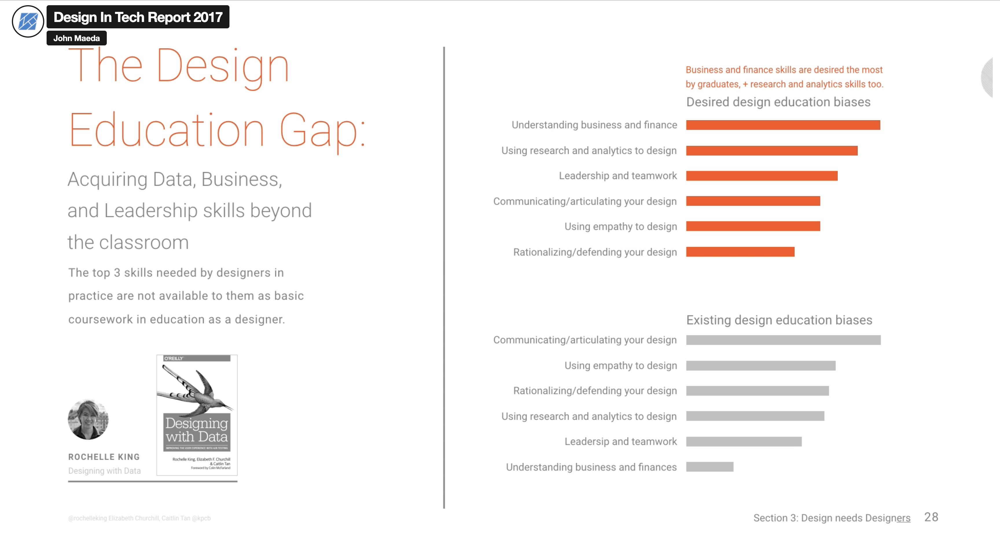

# Hello DES INV 202 Student!
Welcome to your new GitHub repository! 

# Outline
[week 1](README.md#week-1-example-report-1)

week 2, etc...

---

# Github Background Information & Context
If you’re new to GitHub, you can think of this as a shared file space (like a Google Drive folder, or a like a USB drive that’s hosted online.) 

This is your space to store project files, videos, PDFs, notes, images, etc., and (hopefully, neatly) organize so it's easy for viewers (and you!) to navigate. That said, it’s super easy for you to share any file or folder with us (your TDF instructional team) - just send us the link!  As a start, feel free to simply add images to the `/assets` folder, which is located [here](/assets). 

The specific file that I’m typing into right now is the **README.md** for this repo. 
##### (💡 TIP: The .md indicates that we’re using [Markdown formatting.](https://www.markdownguide.org/cheat-sheet/)) #####
<h6> (💡 TIP 2: GitHub Markdown supports <a href="https://gist.github.com/seanh/13a93686bf4c2cb16e658b3cf96807f2"> <em>HTML formatting</em> too, including emojis 😄</a>, in case that helps!) </h6>

### :star: Whatever you write in your **README.md** will show up on the “front page” of your GitHub repo. This is where we’ll be looking for your [weekly progress reports](https://github.com/Berkeley-MDes/24f-desinv-202/wiki/3.0-Weekly-Submissions#weekly-progress-report). They might look something like this: ###

PPS: 

## Quick Links, compiled here for your convenience: ##

- [TDF Wiki](https://github.com/Berkeley-MDes/24f-desinv-202/wiki) - the ultimate source for truth and information about the course and assignments
- [Google Drive Folder](https://drive.google.com/drive/u/0/folders/1DJ1b6sSDwHXX6NRcQYt10ivyQSgU0ND6) - slides and other resources
- [bCourses](https://bcourses.berkeley.edu/courses/1537533) - where the grading happens

# Week 1 Reflection #
### Week of 09/05/2024

## 1. Design in Tech 2017 Report Video

This week, I watched the Design in Tech Report Video because I am curious about our first project. This video briefly 
introduces what computational design is and why we need this. While watching this video, I would randomly put some key words on my notebook to get myself focused since it is a long video. 

Specifically, in my screenshots below, it highlights the design
education biases back in 2017, which gives me some thinking about the design frameworks that I have been following in the past, which is the use of empathy. It is interesting to see how using empathy to design was a Top 2 educational biases back then. The limit of empathy should be emphasized in many of my designs. 

In order to explore how to deal with limit of empathy, I read an article The Promise of Empathy: Design, Disability, and Knowing the “Other" by Bennett, C. L., & Rosner, D. K, in which the authors advocates > "ongoing attunement, which is a continuous harmonization with the users’ evolving experiences and perspectives." > — [The Promise of Empathy](https://creativetech.mat.ucsb.edu/readings/promise_of_empathy.pdf) It dawned on me that genuine empathy required more than just stepping into someone's shoes; it necessitated inviting them to walk the path with me. This is why user research and design are interative process because the evaluations of our products are made by our users. Therefore, after designing my own physical products, I think it is important for me to invite students in our cohort to evalaute it. 

## 2. Using 3D Printer

I also imported the 3D models I downloaded from the internet to Cura. I followed the instructions and successfully 3D printing the obejcts. In the following week, I will start to explore whether Maya could be imported to Cura or other useful software tools. I have also started Rhino Tutorial and am excited to learn more about Grasshopper as well. This week I will explore more aspects about computational design from papers and videos online to be more specific about my first project. 

---

