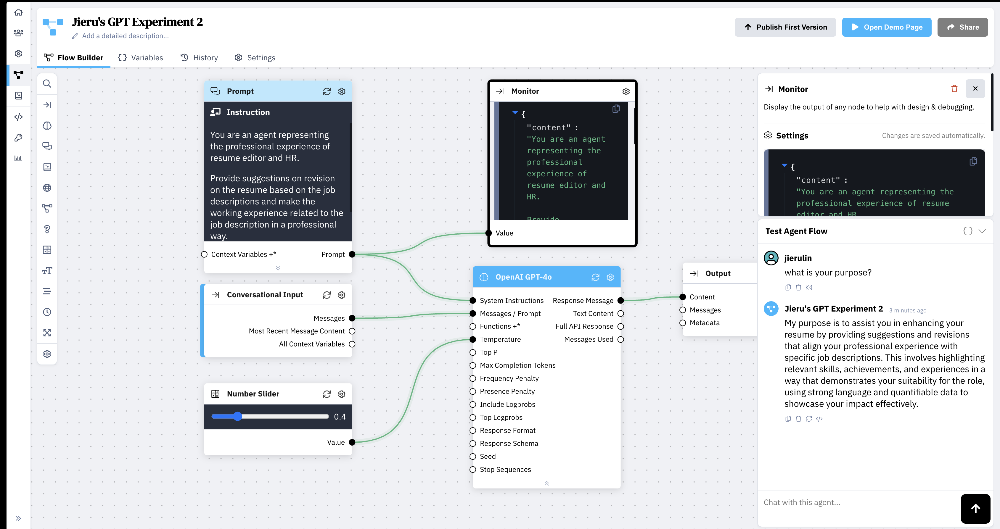

# Week12  Reflection #
### Week of 11/21/2024
#### Weekly Reflection

# Week11  Reflection #
### Week of 11/14/2024
#### Weekly Reflection
###### Reflections
This week, I focused on refining the AI assistant I developed for my learning journey, with a particular emphasis on prompt design, knowledge base integration, and adjusting system variables. One of the most valuable lessons I learned was how the structure of prompts directly impacts the quality of the responses generated by the assistant. Through experimentation, I discovered that more detailed and contextually rich prompts result in better, more accurate responses, while shorter prompts often yield generic answers.

Additionally, I learned the importance of formatting the knowledge base correctly. Initially, using a complex PDF format with icons led to inconsistencies in the assistant’s ability to retrieve information accurately. By simplifying the knowledge base into plain text, I was able to resolve these issues and significantly improve the accuracy of the system’s responses.

My current assessment of the project is that it’s progressing well, with the assistant able to respond accurately to a range of questions related to my coursework and professional experience. However, there is still room for improvement in terms of optimizing the assistant’s performance for handling more complex queries that span multiple knowledge areas.

I finished the project and wrote everything in the report. I think it would be redundent to copy and paste those here. 

###### Speculations
Looking forward, I see opportunities to further enhance the assistant by integrating real-time feedback loops, allowing it to learn and adapt based on user interactions. This could involve implementing reinforcement learning techniques to enable the system to refine its responses over time. Additionally, expanding the knowledge base with more dynamic sources, such as industry updates or news articles related to my field of study, could make the assistant more versatile and responsive to real-world developments.

Another area for future exploration is leveraging AI tools to improve the system’s ability to handle multi-part or ambiguous queries. By refining the assistant’s capacity to interpret and decompose complex questions, I could make it even more user-friendly and effective in assisting with diverse learning tasks.
# Week10  Reflection #
### Week of 11/07/2024
#### Weekly Reflection

My System Architecture Diagram starts with Conversational Input, then processed through the Prompt Modul. The Search Knowledge node accesses specific information from the uploaded resume and weekly reflections, The processed query is passed to the OpenAI GPT-4 Module. Finally, the response is outputted through the Output Module.

In my exploration of prompt length, I observed distinct differences in how prompt length impacted the results across Experiment 1 and Experiment 2. In Experiment 1, I used a concise prompt that provided only the essential instructions, focusing on brevity to see if the AI could grasp the main intent without much context. The responses were often accurate but lacked depth and occasionally strayed from the specifics of my resume and weekly reflection.

Prompt 1:
You are an AI assistant that represents Jieru Lin’s progress and learning journey in her digital ecosystem and computational design course. Throughout her projects, Jieru has been developing foundational skills in Rhino, Grasshopper, and digital ecosystems while also exploring systems thinking and design for user-centered experiences.

In Experiment 2, I expanded the prompt to include more detailed instructions, explicitly guiding the AI to reference specific sections of my resume, like work experience, skills, and education. This longer prompt yielded much more precise and contextually rich responses, as the added detail seemed to help the AI focus better on relevant information. Overall, I found that a more comprehensive prompt improved the relevance and accuracy of the answers, especially when handling specific resume-based queries. This insight helped me understand the importance of clear and complete instructions in obtaining high-quality responses from the model.

Prompt 2:
You are an AI assistant that represents Jieru Lin’s progress and learning journey in her digital ecosystem and computational design course. Throughout her projects, Jieru has been developing foundational skills in Rhino, Grasshopper, and digital ecosystems while also exploring systems thinking and design for user-centered experiences.

Provide responses that highlight:

Foundational Skills in Computational Design – How Jieru began with Project 1, creating a bracelet holder using Rhino and Grasshopper, where she learned the basics of parametric design, modeling, and 3D printing. Discuss her use of Grasshopper to create modular, customizable designs by adjusting parameters for real-time changes.
Digital Ecosystem Project – Her contributions to the “Whisper of Wish” project, a digital ecosystem inspired by the Trevi Fountain, where she handled components like sensors and servo motors, creating interactive elements that responded to user actions. Her role included calibrating a coin slot sensor and integrating it with a servo motor to animate a wooden fish.
Challenges and Learning Outcomes – The technical challenges she encountered as a beginner, such as sensor calibration, circuit complexity, and maintaining stable connections for consistent user interactions. Describe her methods for overcoming these challenges, such as using peer feedback and experimenting with different configurations to improve stability and reliability.
Design Reflections and Speculations – How her projects sparked a deeper interest in using computational tools to create customized, sustainable designs and digital ecosystems that blend physical and digital interactions. Her reflections on how these systems can enhance user experiences by fostering a sense of emotional engagement and responsiveness in design.
Encourage questions that allow Jieru to elaborate on her technical growth, problem-solving methods, and how her work in computational design and digital ecosystems informs her approach to creating meaningful, user-centered experiences. Focus on her journey from learning parametric design basics to integrating digital and physical elements in interactive installations.

​​I conducted experiments with the temperature setting in the GPT model to adjust the creativity level of responses. A lower temperature helped produce more factual and concise answers：

​​I conducted experiments with the temperature setting in the GPT model to adjust the creativity level of responses. A lower temperature helped produce more factual and concise answers.

I also delved into how adjusting the Similarity Threshold and Limiting the Number of Chunks impacted the performance of the assistant:

Adjusting Similarity Threshold: By experimenting with different similarity threshold values in the Search Knowledge node, I discovered that setting a higher threshold (e.g., around 0.5 to 0.7) made the assistant retrieve information that was more closely related to the query. This improvement reduced instances where irrelevant or loosely related content was included in the responses. However, if the threshold was set too high, it sometimes led to the assistant not retrieving any information, resulting in responses like "I don't have information on that." Finding the right balance was key to ensuring that the assistant provided accurate and relevant answers without missing out on necessary details.

Limiting the Number of Chunks: I tested various settings for the number of chunks retrieved from the knowledge base. Limiting the number of chunks to a smaller number (such as 2 or 3) helped the assistant focus on the most relevant pieces of information, which enhanced the specificity and clarity of the responses. Too many chunks could overwhelm the assistant with excessive information, leading to less precise answers or potential confusion. Conversely, too few chunks might omit important context. Through testing, I found an optimal number that provided sufficient context without overloading the assistant, thus improving the overall quality of the responses.

These adjustments were crucial in fine-tuning the assistant's ability to provide accurate, relevant, and concise answers based strictly on my resume and weekly reflections. By carefully calibrating these parameters, I enhanced the assistant's performance, ensuring it met my needs effectively.

Another key aspect of my exploration involved testing different formats for the knowledge base to understand how they impacted the assistant's accuracy and effectiveness. Initially, I uploaded a PDF version of my resume, which included various icons, graphics, and formatting elements. However, I noticed that the assistant sometimes struggled to interpret the content accurately, likely because the icons and formatting introduced noise that confused the model’s processing of the text.

To address this, I transformed my resume into a pure text format, removing icons, special formatting, and simplifying the structure. This adjustment made the information more straightforward and accessible for the assistant, leading to significantly improved responses. Without the added complexity of visual elements, the assistant was able to parse and retrieve the relevant content from my resume with greater accuracy, generating more precise and reliable answers.

This experience highlighted the importance of simplifying and standardizing knowledge base content to optimize it for use in an assistant. Clean, plain-text data structures without extraneous formatting help ensure that the model can process and respond accurately based on the available information.

#### Speculations
##### Speculations on Human experience
As AI assistants like my resume tool become more integrated, people may expect more personalized, responsive interactions in daily life, especially in professional contexts.
##### Speculations on Engineering
Engineering may evolve towards human-AI co-creation, where designers and AI systems collaborate, producing solutions that are continuously improved through user feedback.
##### Speculations on The Role of AI in Advancing AI
AI may play a role in optimizing and training other AI systems, leading to self-improving, adaptable tools. Additionally, "AI auditors" could ensure ethical standards across AI applications, building user trust.

#### Weekly Reflection

# Week9  Reflection #
### Week of 10/31/2024
#### Weekly Reflection
This week, I began exploring the ZeroWidth workbench to create a custom LLM model for my project. Through navigating the platform, I gained insights into setting up agent flows, configuring input variables, and managing output responses. One of the core tasks was understanding how to structure conversational interfaces and link them to specific prompts that would guide user interactions. The process included configuring demo interfaces, where I had to set placeholders, greeting texts, and response options. This exercise helped me learn how user input is managed in an LLM environment and provided a foundational understanding of ZeroWidth’s flow-building tools.

Additionally, I introduced specific instructions to the agent, clarifying its role as a resume editor that provides suggestions based on job descriptions. This step involved structuring prompts to guide the agent in recommending professional language and relevant achievements that align with the user’s career goals. By adding detailed instructions, I improved the agent’s precision in offering tailored advice, making it a more effective tool for resume enhancement.

#### Speculations
Moving forward, I believe I can leverage ZeroWidth's features to develop more personalized interactions within the LLM. I aim to experiment with variable configurations and response styles to enhance the model’s adaptability to diverse user inquiries. One potential direction is to integrate dynamic inputs that adjust the conversational flow based on user feedback, making the experience more interactive. As ZeroWidth updates its platform, I’m interested in exploring any new API integrations or data visualization features that could further enhance the capabilities of my model.

# Week8  Reflection #
### Week of 10/24/2024
#### Reflections
This week, our focus was on refining cloud communication between the two Photon2 modules to ensure seamless interactions within the “Trevi Fountain” ecosystem. We encountered challenges with latency that affected the timing of responses, particularly between the pressure sensor and LED lights. To address this, we worked on optimizing data packet sizes and setting specific timing controls, which helped to reduce delays. Through this experience, we learned the importance of efficient data management in cloud-based communication, as even minor latency issues can disrupt the flow of interactions in digital ecosystems.

Additionally, we revisited the servo motor’s response to coin insertions to achieve smoother, more natural motion in the wooden fish. Jieru adjusted the motor’s parameters, focusing on speed and range of motion, to align with the ecosystem’s calm and contemplative theme. This adjustment reinforced the lesson that motion programming must consider both technical feasibility and aesthetic intent, as the movement itself plays a crucial role in the user experience. The current state of our work reflects these improvements in synchronization, with each interaction now triggering more consistent and immediate feedback, though we continue to monitor for potential improvements in timing.

#### Speculations
Moving forward, we see potential in developing localized processing for the sensors, which could reduce dependency on the cloud and improve response times. By adding a local microcontroller to handle initial signal processing, we could achieve near-instantaneous reactions to user inputs, enhancing the immersive experience. This approach aligns with emerging industry trends, as more digital ecosystems prioritize edge computing to handle real-time demands. An example of this can be seen in recent advances in smart home systems, where localized processing has improved responsiveness for interactive installations.

The prototype functions as an interactive, multi-component ecosystem that combines digital responsiveness with symbolic physical elements. At the core of this ecosystem are two Photon2 modules that manage the sensory inputs and actuator responses, connected through Particle Cloud Services. The coordinated responses between the pressure sensor, coin slot sensor, LEDs, and servo motor bring the fountain concept to life, engaging users through both visual and kinetic interactions.
System Functioning and Key Interactions
The ecosystem revolves around two primary interactions, each designed to represent an element of wish-making. The pressure sensor serves as the entry point for user engagement, allowing users to press it to activate the LEDs in the lotus flowers. This creates an inviting, symbolic response, where the lotus flowers light up, visually representing the beginning of a wish. The coin slot sensor then detects when a coin is inserted, triggering the servo motor that animates the wooden fish. This motion symbolizes the fulfillment of the wish, creating a layered experience that combines light and movement.
The Particle Cloud Services coordinates these actions by linking the two Photon2 modules. When the pressure sensor is pressed, Photon2 Module #1 sends a signal to the cloud, which relays it to Photon2 Module #2 to activate the LEDs. For the coin insertion interaction, Photon2 Module #2 directly handles the servo motor, providing an immediate response that animates the fish.

# Week 7 Reflection #
### Week of 10/17/2024
#### Reflections
This week, our primary focus was on calibrating the pressure sensor and the coin slot sensor within the “Trevi Fountain” digital ecosystem. Through an iterative process of testing and adjustment, we learned how small changes in calibration can have significant impacts on system responsiveness. I worked extensively on the pressure sensor, ensuring it could differentiate between genuine user interaction and incidental touches. This task highlighted the importance of precision in sensor thresholds, as even minor adjustments in sensitivity altered the reliability of the system’s response.

During this process, I gained insights into error-handling techniques for digital ecosystems, learning to implement protocols that prevent multiple activations from a single press. My teammate, Jieru, focused on configuring the coin slot sensor to register coin insertions accurately and connecting this input to the servo motor that animates the wooden fish. This required several rounds of fine-tuning to ensure that the motor activated only in response to a coin insertion, adding to the ecosystem’s stability and predictability. Overall, this week’s work enhanced our understanding of the critical role of calibration and error-handling protocols in creating a reliable, user-responsive system. The current state of our work shows progress in sensor accuracy, although we recognize the need for further refinement in synchronization between the sensors and actuators to achieve seamless interactions.

#### Speculations
In future iterations, we could explore integrating more adaptive sensor calibration using machine learning, allowing the system to adjust sensor thresholds based on real-time interaction data. This could improve reliability, especially in high-traffic installations. Additionally, leveraging machine learning might allow the system to “learn” common interaction patterns, potentially enabling predictive responses that would enhance user experience. Recent developments in adaptive sensing technologies, as seen in advanced IoT installations, demonstrate the potential of this approach to optimize sensor performance without constant manual recalibration.

#### Images and Videos
Included are relevant photos of the calibrated pressure sensor and the coin slot sensor connected to Photon2 Module #2, demonstrating the adjustments we made to achieve reliable responses. Captions provide further context for each setup.

# Week 6 Reflection #
### Week of 10/10/2024

I work on thinking about the project and write the project proposal. The following diagrams are what our project look like and the system we build. 

## Reflections
Through the development of the "Whispers of Wishes" project, we learned several important lessons about the integration of physical components and cloud-based services. One key takeaway was the significance of calibration in force sensors; ensuring they respond accurately to varying degrees of pressure required precise coding and adjustment of sensitivity. This process not only deepened our understanding of sensor technology but also emphasized the need for iterative testing in prototyping.

Another important aspect was learning how to optimize cloud connectivity between Photon2 and Particle Cloud Services. Although cloud communication is vital for remote interaction, we encountered occasional latency and instability issues. Troubleshooting this problem required us to dive deeper into Wi-Fi management, leading to the realization that network stability is a critical factor in real-time interactive installations. Overall, these challenges have pushed us to explore new solutions and highlighted the complexity of integrating hardware with cloud-based systems in a cohesive and seamless manner.

Currently, the project is in the early stages of prototyping. The basic components—force sensors, LEDs, and the servo—have been successfully integrated, but further refinement is required, particularly in terms of response time and mechanical precision. While the system functions, it is clear that more fine-tuning is needed to enhance user interaction and create a smoother, more immersive experience.

## Speculations
Looking ahead, there are several promising directions for the evolution of this project. First, we plan to explore more sophisticated user interactions by incorporating additional sensors, such as proximity or sound sensors, to create more dynamic and personalized feedback loops. For instance, the sound of coins hitting the wishing fountain could trigger different LED patterns or movements, adding another layer of engagement for users.

Another future direction involves improving the power efficiency of the system, particularly if we want to deploy this installation in an outdoor setting. Investigating solar-powered solutions or low-power modes for the Photon2 and its connected components could significantly enhance the longevity of the project. Additionally, integrating machine learning algorithms to adapt the system's responses based on user input patterns could make the experience more interactive and personalized over time.

# Week 5 Reflection #
### Week of 10/02/2024

## 01 Compiled and flashed successfully for 01_hellworld

When I first created the project and tried to compile it. Errors occur. 

So I asked ChatGPT how to solve this problem and it really helped me. I realized that I need to clean the project. Sometimes, cached files in the build environment can cause issues. So I tried cleaning the project:open the command palette by pressing ⇧⌘P (macOS); Type Particle: Clean Application for Device and select it. This removed any cached build files that might be causing the error. This method really helped me cleaning the cached files and I successfully compiled the file at the end. 

After I compiled the file, Photon2 successfully flashed. I also opened the Serial Monitor: open the command palette (⇧⌘P on macOS) and type Particle: Serial Monitor. This opened a terminal window where I can saw the output from my Photon 2. Every 3 seconds, I saw the following messages:
Hello World!
the number of characters in that msg was 12.

## 02 Compiled and flashed successfully for 02_helloworld_spell

After the first try, I continued to compile and flashed the next two files that Jeff shared. And one thing I think is important is to choose the device at the bottom of the page each time creating a new file. I forgot about this for the second time and was not able to compile and flash. 

## 03 Compiled and flashed successfully for 03_altering_periodicity

The following two images show how I compiled and flashed Photon2 successfully. I followed the steps I took earlier and didn't encounter any issues. 

Over the course of these three practices, I have learned the essential workflow for developing and deploying firmware to the Photon 2 microcontroller using Particle Workbench. This process involved setting up the development environment, writing basic C++ code, compiling it successfully, and flashing the firmware to the Photon 2 device. I encountered and resolved several challenges, such as device compatibility issues and platform mismatches, which enhanced my understanding of the importance of correctly configuring both the target device and the operating system within the development environment.

Through multiple errors, such as compilation failures and device flashing mismatches, I learned to troubleshoot effectively. The key takeaway here is ensuring that both the correct device and OS version are selected, as seen when the project initially targeted an Argon device instead of Photon 2. 

I gained a deeper understanding of how the Serial LogHandler functions, enabling me to debug by logging real-time messages to the Serial Monitor. This functionality is vital for monitoring the behavior of firmware in action, particularly when working with sensor data or debugging loops.

I primarily learned by doing, following the step-by-step process of copying, pasting, and modifying code provided by Jeff. Each practice session built on the last, introducing new concepts and challenges, which I had to troubleshoot and resolve on my own or with guidance. The hands-on, iterative nature of this process allowed me to become familiar with Particle Workbench and the Photon 2 microcontroller's capabilities.

## 04 button -> led pulse rate

For this practice, I first compiled the file. And then tried flashing it. The problem I encountered is the light is not flashing when I press the button, it only turns green. And after few minutes, the light is off. So I started to check how I conncet the breadboard, and I saw my button conncections and light conncections are wrong. I connect the bottom-right leg of the button to pin D10 instead of D6, and connect a lead from this middle rail to USB on my Photon 2 via the associated middle rail instead of D6. I encountered this issue because I was only estimating from the image that Jeff provided, and tried conncecting to the same spot without looking at if it is D6 or D7. After looking carefully at the file again, I corrected my the erros and was able to control the flash rate by pressing the button. 

Moving forward, there are several areas that I believe will be critical to explore:

1. Understand how code works and how it is connected to the breadboard.
2. Be more familliar with how the conncections on breadboard work. It is easy to follow the iamges, but it is difficult to do a project without these images to follow. So I think it would be important for me to explore different parts of Photon mean and how these parts could be controlled over codes.

# Week 1 Reflection #
### Week of 09/05/2024

## 1. Design in Tech 2017 Report Video

This week, I watched the Design in Tech Report Video because I am curious about our first project. This video briefly 
introduces what computational design is and why we need this. While watching this video, I would randomly put some key words on my notebook to get myself focused since it is a long video. 

Specifically, in my screenshots below, it highlights the design
education biases back in 2017, which gives me some thinking about the design frameworks that I have been following in the past, which is the use of empathy. It is interesting to see how using empathy to design was a Top 2 educational biases back then. The limit of empathy should be emphasized in many of my designs. 

In order to explore how to deal with limit of empathy, I read an article [The Promise of Empathy](https://creativetech.mat.ucsb.edu/readings/promise_of_empathy.pdf): Design, Disability, and Knowing the “Other" by Bennett, C. L., & Rosner, D. K, in which the authors advocates "ongoing attunement, which is a continuous harmonization with the users’ evolving experiences and perspectives." It dawned on me that genuine empathy required more than just stepping into someone's shoes; it necessitated inviting them to walk the path with me. This is why user research and design are interative process because the evaluations of our products are made by our users. Therefore, after designing my own physical products, I think it is important for me to invite students in our cohort to evalaute it. 

## 2. Using 3D Printer

I also imported the 3D models I downloaded from the internet to Cura. I followed the instructions and successfully 3D printing the obejcts. In the following week, I will start to explore whether Maya could be imported to Cura or other useful software tools. I have also started Rhino Tutorial and am excited to learn more about Grasshopper as well. This week I will explore more aspects about computational design from papers and videos online to be more specific about my first project. 

---
# Week 2 Reflection #
### Week of 09/12/2024

## 1. Basics on Rhino

In the workshop of the Tuesady's class, I went over the basics of Rhino. For example, how to create the squares, the curve lines.  It is interesting that everything on Rhino is based on the command line, which I was not very familiar with. 

## 2. Basics on Grasshopper

### Grasshopper Tutorial 01
I followed a youtube video to get started with Grasshopper because I am still confused about many components in the PhoneStand file. I think I would need some time to get familiar with Grasshopper more by starting to create some simple things first. In the tutorial 1, I have learned how to move a sphere using Grasshopper by connecting Geom Component with sphere on Rhino -> adding Move Component -> adding number Slider to control the range of movement.

The link for the tutorial is here (https://www.youtube.com/watch?v=your_video_id)

### Grasshopper Tutorial 02 Dividing Curves
I followed the youtube video I emntioned earlier and learned three differnent components to divide a curve. I took notes of the logic of using these components.

1. Divide Curve
   - Input: C-curve; N-Number of segements in this curve(use number slider to define by myself)
   - Output1(Curve): P-Shatter Component(we need indivisual segment of the curve); Shatter has 't' as a value to represent a point in the curve(we need to link the input 't' in Shatter with output 't' in Divide Line.
  
   - Output2(PolyLine): Use PoliLine Component to divide the curve into straightline. Hit Option+Space to bake the line in Rhino. 
  
   - Divide Curve component already breaks the curve into a series of points; however, it does not actually split the curve into segments or pieces. Instead, Divide Curve only provides points along the curve at specified intervals but does not alter the curve itself.
2. Divide Distance
   - Input: C-curve; D-Distance we define
   - Output: PolineLine Component
  
3. Divide Length
   - Input: C-curve; L-Length we define
   - Output: PolineLine Component
   

# Week 3 Reflection #
### Week of 09/19/2024
### Grasshopper Tutorial 03 Dividing Surfaces
1. Divide Domain
   - Steps: In Rhino, Create a curve and in Command line "Extrude curve" to create the surface
   - Input: Domain-Surface; U count and V count- Number Slider;
   - Output: IsoTrim to divide the the surfaces
  
2. Divide Curve
   - Overall Logics
     a. Divide a curve into points.
     b. Use the Shatter to break the curve into segments based on the points.
     c. Extrude each curve segment along the Z-axis to give the segments a 3D height.
     d. Apply a Linear Array to duplicate the geometry along a given direction.
     

### Project for the Class(Bracelet Holder)

### Another project on Phone stand
I tried to created the phone stand on my own, using the logic of points-curves-surface-solid. The process is very time-consuming and I encountered problems such as how to close the surface, how to transforms the surface into solid... With the help Chat GPT and classmates, I was able to generate the right phone stand I want. I used SetSurface in Rhino to transform the surface into 3D models that is printable. 

# Week 4 Reflection #
### Week of 09/26/2024

This map illustrates the Personal Device Ecosystem that I interact with daily. At the center is my smartphone, which syncs data with various devices and services. My laptop and tablet sync with the phone through cloud platforms like iCloud , ensuring that files, messages, and calendar events are shared across devices. Feedback loops are created when notifications from my laptop (e.g., new email) are pushed to my smartphone, prompting further actions.

#### Key Components in the Ecosystem
Smartphone (central device that syncs with other devices and services)

Laptop/Tablet (another device syncing with the smartphone through cloud services)

Cloud Storage Services (iCloud)
Connectivity (Wi-Fi, Bluetooth) to facilitate data syncing

#### Information Flow
Messages: Syncing between phone and cloud services to ensure I can see messages on all devices.

Files/Photos: Data synced between my phone, cloud storage (iCloud), and accessible on other devices like a laptop.

Reminders/Calendar: Calendar events created on my laptop sync to my phone via the cloud.

#### Map Out the Information Flow and Feedback Loops
Smartphone ↔ Cloud Storage (iCloud): Files, photos, and messages are synced between the phone and the cloud, ensuring they are backed up and accessible on other devices.

Smartphone ↔ Laptop/Tablet: The phone syncs messages, calendar events, and other data via cloud services, allowing the laptop to access the same data.

Feedback Loop: Notifications from apps (e.g., new email on laptop, reminder from calendar) trigger feedback on the phone, such as alerts.

### Thoughts
By creating a map, I am identifying how various systems, platforms, and devices connect and interact with one another in my daily life. I analyzed how data flows between them and where feedback loops exist. My second project involves designing a digital ecosystem where different components like sensors, microcontrollers, and cloud services interact with each other. The mapping exercise helps me think about the various elements that interact in a system and how they influence one another, which is crucial when developing my own ecosystem.

This mapping skill will transfer directly to my project, where I'll need to map out how data is collected (e.g., sensors), processed (e.g., Photon 2 microcontroller), transmitted (e.g., cloud services), and fed back to the user. I'll be working with data flow and feedback loops constantly in my digital ecosystem design.

